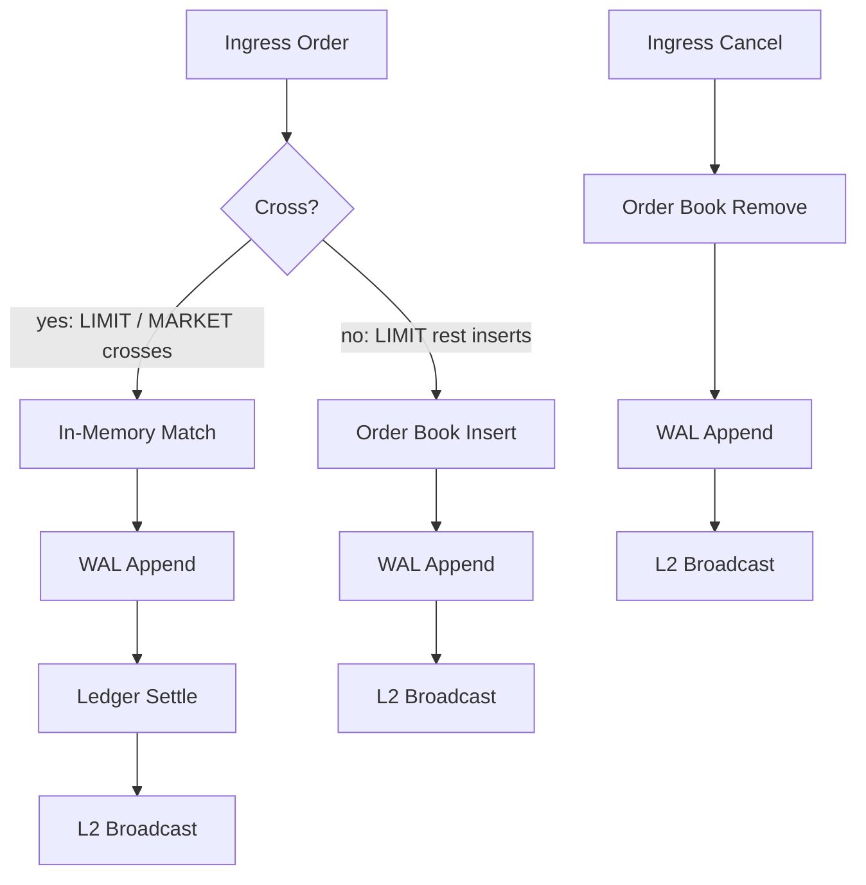

# orderbook-engine

**High-Throughput In-Memory Orderbook & Matching Engine**

> ⚠️ **Estado / Status:** Scaffolding inicial — hoja de ruta congelada, implementación pendiente.
> Initial scaffolding — roadmap frozen, implementation pending.

---

## Descripción / Description

**EN** — An in-memory order matching engine with strict Price-Time Priority, built in TypeScript. Orders (LIMIT, MARKET, CANCEL with GTC and IOC time-in-force) are matched against an in-memory order book, persisted through an append-only WAL with Event Sourcing over SQLite (better-sqlite3) for deterministic state replay on boot, and settled through a double-entry ledger with atomic Maker/Taker fund reservation. It exposes L2/L3 market data streaming (SSE/WebSocket) and ships with a benchmark suite (orders/sec and p99 latency).

**ES** — Motor de calce (matching) de órdenes en memoria con prioridad estricta Precio-Tiempo, construido en TypeScript. Las órdenes (LIMIT, MARKET, CANCEL con Time-in-Force GTC e IOC) se calzan contra un libro de órdenes en memoria, se persisten mediante un WAL append-only con Event Sourcing sobre SQLite (better-sqlite3) para reconstrucción determinista del estado en el arranque, y se liquidan a través de un ledger de doble entrada con reserva atómica de fondos Maker/Taker. Expone streaming de datos de mercado L2/L3 (SSE/WebSocket) e incluye una suite de benchmarks (órdenes/segundo y latencia p99).

---

## Flujo de eventos / Event flow



**Leyenda / Legend**

| Rama / Branch | Eventos emitidos / Events emitted |
|---|---|
| Cruce (`Ingress Order → In-Memory Match → WAL Append → Ledger Settle → L2 Broadcast`) | `order_matched`, `funds_reserved`, `funds_settled` |
| No-cruce (`Ingress Order → Order Book Insert → WAL Append → L2 Broadcast`) | `order_placed` |
| Cancelación (`Ingress Cancel → Order Book Remove → WAL Append → L2 Broadcast`) | `order_cancelled` |

---

## Benchmarks objetivo / Target benchmarks

| Métrica / Metric | Objetivo / Target | Validación / Validation |
|---|---|---|
| Throughput | ≥ 50,000 orders/sec | SPRINT_05 |
| Match latency (p99) | ≤ 2 ms | SPRINT_05 |
| L2 broadcast latency (p99) | ≤ 10 ms | SPRINT_05 |
| State replay (1M events) | ≤ 30 s | SPRINT_05 |

*ES:* ≥ 50.000 órdenes/seg; latencia de match p99 ≤ 2 ms; latencia de broadcast L2 p99 ≤ 10 ms; replay de estado con 1M de eventos ≤ 30 s.

---

## Tech stack

> Nota: las versiones exactas (parches) quedan fijadas en `package.json`; esta tabla refleja las dependencias verificadas contra `package.json` del scaffolding.

| Pieza / Piece | Versión / Version | Uso / Purpose |
|---|---|---|
| Next.js | 16.x (App Router) | Servidor de aplicación, rutas de API de ingress y streaming |
| React / React DOM | 19.2.x | Framework UI del panel de visualización (peer de Next.js 16) |
| TypeScript | 5.9.x (`strict`) | Lenguaje, verificación estricta de tipos |
| Tailwind CSS | 4.x (`@tailwindcss/postcss`) | Estilos del panel de visualización |
| better-sqlite3 | 12.x (`@types/better-sqlite3` 7.6.x) | WAL / Event Store y ledger sobre SQLite |
| drizzle-orm | 0.44.x | Capa de acceso tipada a SQLite |
| zod | 4.x | Validación de entrada en el límite de la API y de payloads de eventos |
| tsx | 4.19.x | Ejecución standalone del motor y de la suite de benchmarks |
| ESLint | 9.x (flat config, `eslint-config-next` 16.x) | Linting del proyecto |
| Node.js | ≥ 22 LTS (24 LTS recomendado) | Runtime |

---

## Estructura del repositorio / Repository structure

```
orderbook-engine/
├── README.md
├── package.json
├── tsconfig.json                # strict: true, noEmit, paths @/* → src/*
├── next.config.ts               # serverExternalPackages: ["better-sqlite3"]
├── next-env.d.ts
├── eslint.config.mjs            # ESLint 9 flat config (core-web-vitals + typescript)
├── postcss.config.mjs           # Tailwind v4
├── .github/
│   └── workflows/
│       └── ci.yml               # Pipeline CI (gate del proyecto)
├── scripts/
│   └── benchmark.mjs            # Entrypoint de benchmarks (placeholder hasta SPRINT_05)
├── docs/
│   ├── ARCHITECTURE.md          # Arquitectura, complejidad, WAL, ledger, streaming
│   ├── SECURITY.md              # Seguridad y checklist por sprint
│   └── testing/                 # (reservado) instrucciones de testeo por sprint
├── sprints/                     # Hoja de ruta congelada (README + 6 archivos de sprint)
│   ├── README.md
│   ├── SPRINT_00_SETUP_AND_CORE_DATA_STRUCTURES.md
│   ├── SPRINT_01_MATCHING_ENGINE_CORE.md
│   ├── SPRINT_02_WAL_PERSISTENCE_AND_STATE_REPLAY.md
│   ├── SPRINT_03_DOUBLE_ENTRY_SETTLEMENT_LEDGER.md
│   ├── SPRINT_04_L2_ORDERBOOK_STREAMING_API.md
│   └── SPRINT_05_BENCHMARK_SUITE_POLISH_AND_CI.md
└── src/                         # Placeholders por dominio (implementación por sprint)
    ├── core/                    # Estructuras del libro: niveles de precio, colas FIFO, sequence
    ├── engine/                  # Motor de matching: intake, reglas de cruce, ejecución
    ├── storage/                 # WAL / Event Store (SQLite + drizzle)
    ├── ledger/                  # Ledger de doble entrada
    ├── api/                     # Rutas de ingress (Next.js)
    └── app/                     # App Router: layout y página de visualización
```

---

## Scripts

| Script | Comando | Descripción |
|---|---|---|
| `dev` | `next dev` | Servidor de desarrollo con HMR en `localhost`. |
| `build` | `next build` | Build de producción del app router. |
| `start` | `next start` | Sirve el build de producción, bind a `localhost` por defecto. |
| `lint` | `eslint .` | Linting del proyecto con ESLint 9 (config flat de Next 16). |
| `tsc` | `tsc --noEmit` | Verificación de tipos estricta, sin emitir. |
| `bench` | `node scripts/benchmark.mjs` | Entrypoint de la suite de benchmarks standalone (órdenes/seg, p99, replay de 1M eventos) sin arrancar Next.js; placeholder que se implementa por completo en SPRINT_05. |

---

## Roadmap

> La hoja de ruta autoritativa y detallada está en [`sprints/README.md`](./sprints/README.md). Los objetivos intermedios de esta tabla derivan del alcance del proyecto.

| Sprint | Nombre | Foco |
|---|---|---|
| SPRINT_00 | Setup & Core Data Structures | Scaffolding, config estricta, estructuras del libro (niveles de precio, colas FIFO, sequence). |
| SPRINT_01 | Matching Engine Core | Calce Precio-Tiempo para LIMIT / MARKET / CANCEL con GTC e IOC. |
| SPRINT_02 | WAL Persistence & State Replay | Event log append-only, checksums, snapshot + compaction, replay determinista. |
| SPRINT_03 | Double-Entry Settlement Ledger | Reserva Maker/Taker, liquidación atómica, rollback. |
| SPRINT_04 | L2 Orderbook Streaming API | Snapshot + deltas vía SSE/WebSocket, reconciliación, backpressure. |
| SPRINT_05 | Benchmark Suite, Polish & CI | Benchmarks objetivo, afinado y pipeline CI. |

---

## Documentación

- [`docs/ARCHITECTURE.md`](./docs/ARCHITECTURE.md) — arquitectura, análisis de complejidad, WAL/Event Sourcing, ledger y streaming.
- [`docs/SECURITY.md`](./docs/SECURITY.md) — integridad del WAL, determinismo, validación, aislamiento y checklist de seguridad por sprint.
