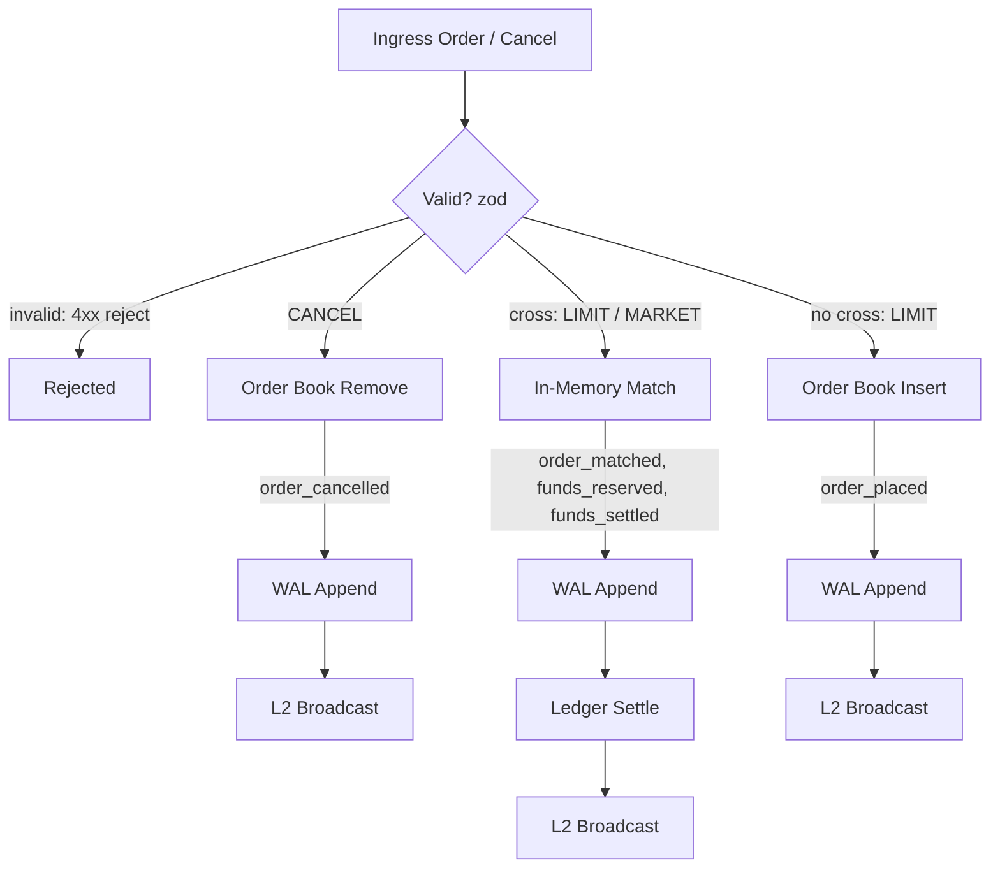
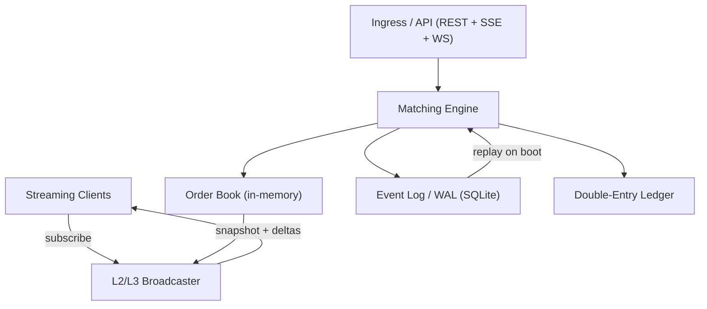

# Arquitectura — High-Throughput In-Memory Orderbook & Matching Engine

> **Estado del documento:** borrador de diseño pre-implementación (scaffolding congelado). Todo lo descrito es el objetivo de arquitectura acordado; se verificará contra el código a medida que cada sprint se complete.

## 1. Visión general

El motor mantiene el libro de órdenes **íntegramente en memoria** y usa SQLite únicamente como log de eventos (WAL/Event Sourcing) y como almacén del ledger de liquidación. La reconstrucción del estado es determinista: en el arranque se re-ejecuta el log de eventos desde el último snapshot, sin depender de caches ni de bases de datos que reproduzcan el estado "caliente".

### Principios de diseño

1. **In-memory-first** — el libro de órdenes vive en memoria para cumplir los objetivos de latencia (p99 ≤ 2 ms). SQLite nunca está en el hot path del matching; el log se escribe dentro de la misma transacción de cada comando.
2. **Determinismo** — dado un log de eventos íntegro, el replay produce exactamente el mismo estado en cualquier máquina y en cualquier momento. Prohibido `Date.now()`/`Math.random()` dentro del payload de eventos; la única fuente de orden es un `sequence` monotónico.
3. **Event sourcing** — el WAL es la fuente de verdad. El estado en memoria es una proyección derivable del log. Toda mutación se modela como un evento append-only.
4. **Prioridad Precio-Tiempo** — un match primero elige el mejor precio y, dentro del nivel, la orden más antigua (menor `sequence`). El tiempo de reloj nunca decide la prioridad; solo la decide el `sequence` monotónico.

## 2. Flujo de eventos

Cada comando (orden o cancelación) es **una transacción SQLite**: los eventos se escriben en el log y los movimientos del ledger se aplican dentro del mismo `BEGIN IMMEDIATE ... COMMIT`. El broadcast L2 ocurre solo después del commit, por lo que ningún consumidor observa estado no persistido. El evento `order_matched` se descompone en su serie `funds_reserved` → `funds_settled` según el ciclo Maker/Taker (ver §5).

## 3. Análisis de complejidad (foco del documento)

### 3.1 Cotas por operación

| Operación | Complejidad | Mecanismo |
|---|---|---|
| Mejor precio (best bid / best ask) | **O(1)** | Punteros directos a los extremos del árbol de niveles (mínimo ask, máximo bid). |
| Localizar / insertar / eliminar nivel de precio | **O(log N)** | Árbol balanceado (AVL/red-black) o skiplist ordenados por precio. |
| Encolar / desencolar orden dentro de un nivel | **O(1)** | Cola FIFO por nivel con punteros `head`/`tail`. |
| Cancelar orden en mitad de cola | **O(1)** | Hash `orderId → (nivel, nodo)` + lista doblemente enlazada para desenlazar sin recorrer. |
| Barrer niveles para una orden MARKET | O(K log N) con K = niveles tocados | Iterador ordenado del árbol/skiplist; K niveles se recorren en O(K) amortizado. |
| Snapshot L2 (top-K niveles) | O(K) | Iteración ordenada ascendente/descendente desde los extremos. |
| Replay de E eventos | O(E) | Lectura secuencial del log; cada evento se aplica en O(log N) u O(1) según su tipo. |

### 3.2 Comparativa de estructuras para niveles de precio

| Criterio | BTreeMap (AVL/red-black) | SkipList | Map (hash) + BinaryHeap |
|---|---|---|---|
| Best bid/ask | O(1) con punteros a extremos | O(1) con punteros a extremos | O(1) al top del heap (solo un lado por heap); retirar el top cuesta O(log N) |
| Insertar nivel | O(log N) peor caso | O(log N) esperado | O(log N) en heap, O(1) en map |
| Eliminar nivel arbitrario | O(log N) | O(log N) | ❌ heap no soporta delete sin búsqueda lineal O(N) |
| Predecesor / sucesor de precio | O(log N), u O(1) con enlaces enlazados | **O(1)** vía enlaces horizontales | ❌ no soportado |
| Iteración ordenada (snapshot L2, barridos) | O(N) | O(N) | ❌ el hash no preserva orden; el heap solo entrega orden extrayendo |
| Determinismo | Totalmente determinista | Aleatorio solo al construir niveles (se puede sembrar o fijar) | Determinista |
| Implementación en TS | Propia (~300 líneas, rotaciones) | Propia (~150 líneas) | Nativa (Map + array) |

**Opción recomendada: SkipList para niveles de precio** (BTreeMap/AVL como alternativa equivalente si se exige peor caso garantizado):

- Cumple O(log N) para insertar/eliminar nivel y **O(1) para predecesor/sucesor de precio**, operación crítica para el barrido de market orders y para la reconciliación de profundidad.
- Su implementación es sustancialmente más simple que un AVL/red-black y su costo esperado es igualmente logarítmico; con niveles sembrados no introduce aleatoriedad en el estado.
- El determinismo no se ve comprometido: la estructura de niveles solo depende de la secuencia de precios insertados, que a su vez depende únicamente de los eventos.

**Por qué `Map` (hash) no sirve para predecesor/sucesor:** un hash no mantiene orden total de claves. Para calzar hay que responder *"¿qué nivel cruza el precio entrante?"* y *"¿cuál es el siguiente mejor nivel tras vaciar este?"*; un `Map` exige recorrer todas las claves o mantener una segunda estructura ordenada duplicada. La combinación `Map + BinaryHeap` además no permite eliminar niveles arbitrarios de forma eficiente (necesario al vaciarse un nivel por match o cancelación).

### 3.3 Garantía Precio-Tiempo con `sequence`

- Cada orden recibe un **`sequence` monotónico** (entero, asignado por el motor en un solo hilo, sin huecos ni reutilización) en el momento de su aceptación.
- La prioridad es estrictamente **precio → sequence**: dentro de un nivel (mismo precio), las colas FIFO atienden siempre al `head` (menor `sequence`).
- Al no usar relojes, dos órdenes no pueden "empatar" de forma ambigua: el orden de llegada al motor coincide con el orden de asignación de `sequence`.
- El motor es **single-threaded** (un event loop): la asignación de `sequence` y la mutación del libro nunca compiten, lo que hace el determinismo trivial de razonar.

## 4. WAL & Event Sourcing

> Desambiguación: "WAL" aquí es el **log de eventos del dominio** (append-only). No confundir con el `journal_mode=WAL` de SQLite, que es una configuración del propio SQLite (también habilitada).

### 4.1 Formato de eventos

Los eventos se almacenan en una tabla inmutable (solo `INSERT`; triggers rechazan `UPDATE`/`DELETE`):

| Campo | Tipo | Nota |
|---|---|---|
| `seq` | integer PK | Secuencia monotónica global |
| `event_type` | text | `order_placed`, `order_matched`, `order_cancelled`, `funds_reserved`, `funds_settled` (con `CHECK`) |
| `payload` | text (JSON) | Validado con zod al escribir y al leer |
| `checksum` | text | Checksum del registro (por ejemplo CRC32C sobre `seq + event_type + payload`) |
| `created_at` | integer | Metadato logístico del servidor (permitido: **no** participa en la reconstrucción del estado) |

### 4.2 Append-only con checksum

- Cada registro lleva checksum; cada segmento/periodicidad de compactación puede sumar un checksum agregado (hash del rango de eventos) para detectar corrupción temprana.
- No hay edición ni borrado: corregir historia está prohibido; ante corrupción se trunca desde el último snapshot válido (ver `docs/SECURITY.md`).

### 4.3 Snapshot + compaction

- Periódicamente (por tamaño de log o número de eventos) se escribe un **snapshot** del estado en memoria junto con el hash de ese estado y el `seq` al que corresponde.
- **Compaction:** los eventos anteriores al último snapshot se pueden archivar/eliminar porque el estado ya está resumido.
- Replay = cargar snapshot + re-ejecutar los eventos con `seq > snapshot.seq`.

### 4.4 Replay determinista en arranque

- El replay re-ejecuta el log en orden estricto de `seq` y reconstruye libro + ledger + niveles L2.
- Reglas de oro:
  - **Prohibido `Date.now()` o `Math.random()` dentro del payload de eventos** o de cualquier cálculo que afecte el estado reconstruido.
  - IDs de orden derivados del `sequence` (no UUID aleatorios dentro del hot path).
  - Precios y cantidades en **enteros de escala fija** (nunca `number` con punto flotante para dinero).
  - Verificación post-replay: hash del estado reconstruido vs hash guardado en el snapshot (detección de deriva no determinista).

### 4.5 Transacciones SQLite

- Un comando = una transacción (`BEGIN IMMEDIATE`): inserción de los eventos del comando + aplicación de movimientos del ledger + actualización de snapshot si corresponde + `COMMIT`. Cualquier fallo → `ROLLBACK` total, sin efectos parciales observables.
- `journal_mode=WAL` y `synchronous=NORMAL` para durabilidad y concurrencia razonables sin bloquear el motor.

## 5. Ledger de doble entrada

- **Invariante:** en todo momento y para cada cuenta, Σ débitos = Σ créditos (equivalente: balance de cada cuenta ≥ 0 por constraint; la suma global de variaciones es cero).
- **Reserva antes de match:** al colocar una orden que requiere fondos, los fondos se reservan (`funds_reserved`); los Makers ya tienen reserva activa. El Taker reserva antes de calzar. Sin reserva completa no hay match.
- **Liquidación atómica:** la serie `funds_settled` materializa los débitos/créditos Maker/Taker dentro de la misma transacción del match; el ledger se actualiza con `INSERT` de movimientos (immutable) y actualización de balances.
- **Rollback ante fallo parcial:** si cualquier paso falla (fondos insuficientes, constraint violada, error de escritura), la transacción se aborta completa: el libro queda como antes y la orden entrante se rechaza sin efectos.
- Red de seguridad: constraints SQLite (`CHECK balance >= 0`, FK de cuentas, uniqueness de referencias) que hacen **imposible** un ledger inconsistente aunque el código falle (detalle en `docs/SECURITY.md`).

## 6. Streaming L2/L3

### 6.1 Modelo

- **L2** — libro agregado por nivel: snapshot inicial + deltas por nivel (insert/update/remove con cantidades).
- **L3** — orden por orden: eventos individuales de colocación, match y cancelación.
- Ambos canales emiten un `seq` de stream monotónico que permite a los clientes detectar huecos y re-sincronizarse.

### 6.2 SSE vs WebSocket

| Criterio | SSE | WebSocket |
|---|---|---|
| Dirección | Solo servidor → cliente | Bidireccional |
| Reconexión | Nativa (Last-Event-ID, auto-retry del navegador) | Manual (protocolo propio) |
| Overhead por frame | Bajo sobre HTTP/2 | Bajo; frames binarios |
| Integración Next.js 16 | Nativa (Route Handler con ReadableStream) | Requiere servidor WebSocket adicional |
| Carga de conexiones | Muy alta, multiplexada | Alta, pero más estado por conexión |
| Caso ideal | L2/L3 read-only, dashboards | L3 con envío de órdenes por el mismo canal |

**Recomendación:** SSE como canal primario para L2 y L3 (read-only, reconexión nativa, integración directa en Next.js 16). WebSocket se incorpora solo si un sprint posterior exige envío de órdenes por el canal de streaming o latencia de frame inferior en conexiones con keep-alive agresivo. El objetivo de broadcast p99 ≤ 10 ms aplica a ambos canales.

### 6.3 Reconciliación de profundidad

- Cada delta lleva `seq`; si un cliente detecta un hueco (`seq` faltante), se re-suscribe: recibe snapshot + deltas desde el `seq` anterior.
- Heartbeat periódico con el `seq` actual para detectar desconexiones silenciosas.

### 6.4 Backpressure

- El broadcaster **nunca bloquea el motor de matching**: encola en buffers acotados por suscriptor.
- Políticas por conexión lenta: coalescing de deltas del mismo nivel (solo el último cuenta) y, de persistir, desconexión del consumidor con código de "re-suscríbete" (drop-slowest, nunca drop del motor).
- Límites de conexiones y tasas por IP documentados en `docs/SECURITY.md`.

## 7. Diagrama de componentes

## 8. Decisiones técnicas

1. **Motor standalone importable** tanto por Next.js (rutas de ingress) como por `tsx` (benchmarks y herramientas de replay). El core no depende de `next` ni de `next/headers`.
2. **Single-threaded event loop** para el motor: determinismo trivial, sin locks, sin carreras en el `sequence`.
3. **SkipList (alternativa AVL/red-black)** para niveles de precio; colas FIFO con `head`/`tail` y hash `orderId → nodo` por nivel.
4. **Enteros de escala fija** para precios/cantidades; zod normaliza y valida en el límite.
5. **Transacción por comando** (WAL + ledger + match) en SQLite con `journal_mode=WAL`; cliente singleton en `globalThis` y `serverExternalPackages: ['better-sqlite3']` en `next.config` (patrón validado para Next.js + better-sqlite3).
6. **SSE primario, WebSocket opcional** para streaming L2/L3 (ver §6.2).
7. **Bind a `localhost` por defecto** en todos los modos (dev, start, bench sin red).

## 9. Riesgos abiertos

| Riesgo | Mitigación propuesta | Estado |
|---|---|---|
| GC pauses de Node afectan el p99 ≤ 2 ms | Objetos pre-asignados en el hot path, medición con `--expose-gc`, benchmark que lo detecte | Abierto (SPRINT_05) |
| Next.js dev vs motor de producción difieren en rendimiento | Benchmarks siempre contra el motor standalone vía `tsx`; Next solo como frontera | Abierto (SPRINT_05) |
| Replay de 1M eventos > 30 s | Snapshot + replay incremental; benchmark de replay en SPRINT_05 | Abierto |
| Precisión monetaria con `number` | Enteros de escala fija decididos; pendiente definir escala exacta por mercado | Decidido en principio, escala por fijar |
| Límites de profundidad L2 y tamaño de snapshot | Política de top-K y tamaño máximo por fijar en SPRINT_04 | Abierto |
| Crecimiento del log entre compactions | Umbrales de compactación por número de eventos y por tamaño | Abierto (SPRINT_02) |
| Seguridad del streaming en modo local | Sin autenticación en localhost; añadir tokens solo si se expone fuera | Ver `docs/SECURITY.md` |
